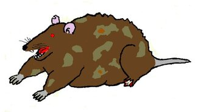

# Terrain tools 

A university project with terrain generator and terrain renderer

Our technology stack:

- C++ (mostly C++20)
- CMake
- [GoogleTest](https://github.com/google/googletest)
- [GoogleBench](https://github.com/google/benchmark)

[Our plans & related material](./Plans/README.md)

